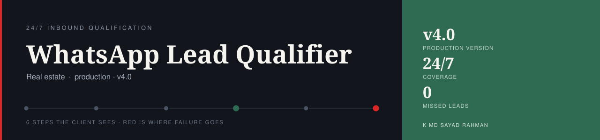
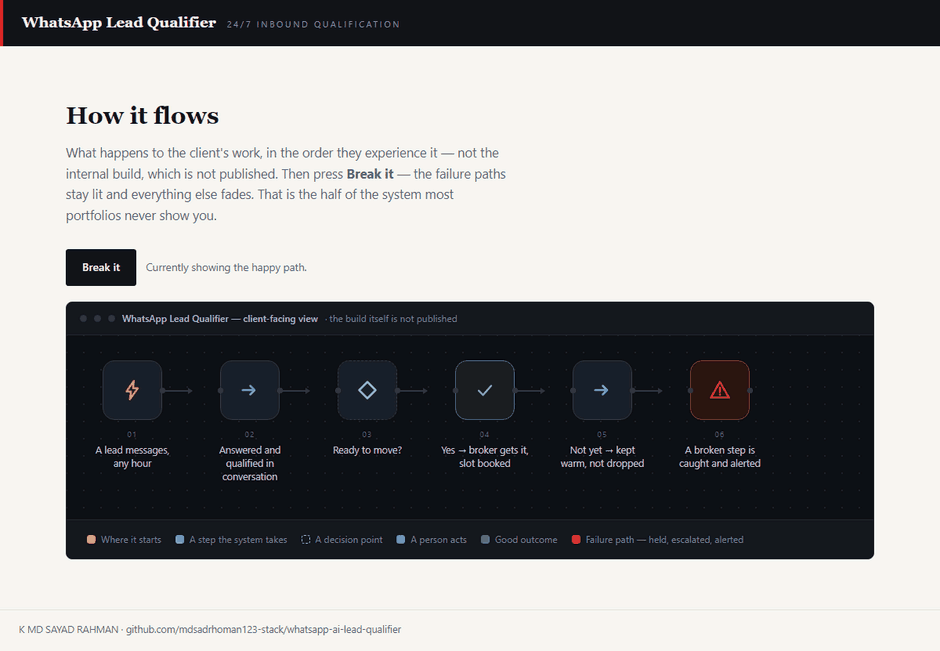
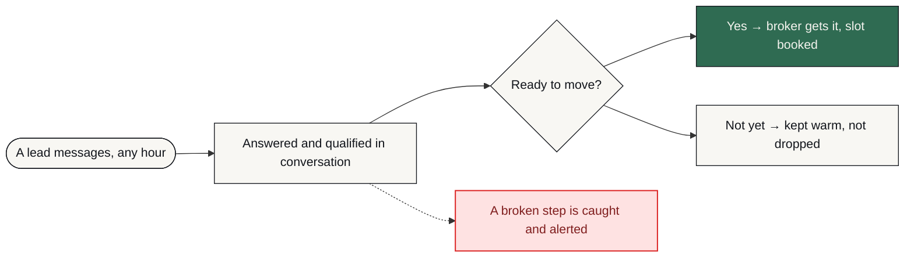

# WhatsApp Lead Qualifier

**Every inbound WhatsApp lead is answered immediately, qualified in conversation, and either handed to an agent with full context or put into a follow-up sequence.**

     [](https://github.com/mdsadrhoman123-stack/whatsapp-ai-lead-qualifier/actions/workflows/honesty-check.yml)



**The system working, then the same system taking a hit on purpose and catching it.** That is a recording of [`docs/index.html`](docs/index.html) in this repository — one file, no build step, no network — with the **Break it** button actually pressed, not illustrated. Every red path carries what happens next: held, escalated, or someone told. Nothing fails quietly.

> [!NOTE]
> **What this is.** A production-grade system built to a brief that businesses in this sector post publicly, in their own words — the problem exactly as they stated it, not one invented to demonstrate something. It was engineered the way anything a business actually depends on has to be: the failure paths designed before the features, every one of them logged and alerted rather than left to chance. It runs on my own infrastructure. It is ready to deploy for any business with this problem, and it has not been sold or deployed into a customer's business yet.

| | |
| :--- | :--- |
| **Built for** | Real estate brokers |
| **The brief** | The problem exactly as businesses in this sector post it — public job briefs on Upwork and Fiverr, in their words, not my framing |
| **Industry** | Real estate |
| **Status** | running on my own n8n |
| **Failure paths designed** | 7 — each with how it is detected, what the system does about it, and who finds out |
| **My role** | Sole engineer — scoping, architecture, build, failure design and operation |
| **Availability** | Ready to deploy for any business with this problem — built once as a product, not as a one-off. Running on my own infrastructure; not sold yet. |

---

### On this page

[The problem](#the-problem) · [What changed](#what-changed) · [How it works](#how-it-works) · [The shape of it](#the-shape-of-the-system) · [When it breaks](#when-it-breaks) · [Why this way](#why-it-is-built-this-way) · [Limitations](#honest-limitations) · [What is here](#what-is-in-this-repository) · [Read deeper](#read-deeper)

---

## The problem

Inbound property enquiries arrive at every hour, and the first reply wins. A lead who messages at 11pm and hears nothing until morning has usually already messaged someone else.

Manual triage cannot cover the clock, and a broker reading back through a thread to work out what a lead wants is time the lead does not wait for.

## What changed

| | Before | After |
| :--- | :--- | :--- |
| **Reply time at 11pm** | Next morning | Immediate |
| **Qualification** | Broker reads the thread back | Done in conversation, summarised |
| **Handoff context** | “Someone asked about a flat” | Full conversation attached |
| **Viewing booking** | A second exchange to arrange it | Slot booked while the lead is hot |
| **Cold leads** | Forgotten | 3-day follow-up sequence |
| **A failed step** | Nobody notices | Error logged and alerted live |

<sub>Before/after describes the change in process, not benchmarked throughput. Where a number is not measured, it is not claimed.</sub>

## How it works

Every inbound message is signature-verified, deduplicated, and answered by an agent that holds session memory across the conversation. Hot leads fire an instant broker alert with the full conversation and an auto-booked calendar slot; the rest enter a follow-up sequence.

<table>
<tr>
<td width="42" valign="top" align="center"><b>01</b></td><td valign="top"><b>A lead messages</b><br>On WhatsApp, at any hour, with no form to fill in.</td>
</tr>
<tr>
<td width="42" valign="top" align="center"><b>02</b></td><td valign="top"><b>The request is verified</b><br>Signature-checked before anything runs, and deduplicated so one message means one conversation.</td>
</tr>
<tr>
<td width="42" valign="top" align="center"><b>03</b></td><td valign="top"><b>Someone answers immediately</b><br>The agent holds context across the whole conversation, so the lead is not repeating themselves.</td>
</tr>
<tr>
<td width="42" valign="top" align="center"><b>04</b></td><td valign="top"><b>The clock is respected</b><br>Inside hours a live agent takes over. Outside hours the lead is still qualified, not parked.</td>
</tr>
<tr>
<td width="42" valign="top" align="center"><b>05</b></td><td valign="top"><b>A hot lead reaches the broker</b><br>With the full conversation and a calendar slot already booked — not a notification to go and read something.</td>
</tr>
<tr>
<td width="42" valign="top" align="center"><b>06</b></td><td valign="top"><b>A cold lead is kept</b><br>A three-day follow-up sequence, because not-now is not the same as no.</td>
</tr>
<tr>
<td width="42" valign="top" align="center"><b>07</b></td><td valign="top"><b>A broken step is visible</b><br>Every critical path logs errors to a live alert channel. This is the part that keeps the zero honest.</td>
</tr>
</table>

### How it flows

<sub>What happens to the client's work, in the order they experience it. The internal build — node graph, execution order, prompts, thresholds — is deliberately not published.</sub>



<details>
<summary><b>What the shapes mean</b> — colour is not the only signal</summary>

| Shape | Means |
| :--- | :--- |
| **rounded** | Where the client's process starts |
| **box** | Something the system does |
| **diamond** | A decision point |
| **slanted** | A person has to act |
| **green box** | The good outcome |
| **red box** | Failure path — held, escalated or alerted |

Red appears in exactly one role across every repo in this portfolio: where failure goes. Nowhere else. If you see red, something is being held, escalated or alerted.
</details>

> **Walk it interactively** — [`docs/index.html`](docs/index.html) is a single self-contained page. Download it, open it in any browser, and press **Break it** to watch the failure path light up. Nothing to install, no network calls.

## The shape of the system

Parts and the role each one plays. Not the wiring — no execution order, no prompt text, no thresholds. That is a deliberate line, and the last branch of the tree names exactly what sits on the other side of it.

```text
WhatsApp Lead Qualifier — the running system
│
├── Interfaces ...................... the systems it talks to
│   ├── WhatsApp Business API ....... Where the leads already are
│   └── Google Calendar API ......... Books the viewing slot at the moment the lead is hot
│
├── Judgement ....................... where a decision or a piece of writing is made
│   └── Claude API .................. Runs the qualifying conversation with session memory
│
├── Memory .......................... what is remembered, and for how long
│   └── Redis ....................... Deduplication, so one message is never processed twice
│
├── Ground .......................... what the whole thing runs on
│   └── n8n ......................... Orchestration, self-hosted
│
├── Failure design .................. 7 paths, designed before the features
│   ├── detected by ................. an error output, a timer, or a failed connection
│   ├── handled by .................. falling back, holding, or halting — never guessing
│   └── announced to ................ a named person, with the reason attached
│
└── Not in this repository .......... the part that would let you skip the thinking
    ├── the node graph .............. which part runs after which, and on what condition
    ├── the prompts ................. wording, guardrails, the shape of the output
    ├── the thresholds .............. what counts as urgent, late, at capacity, a match
    └── the credentials ............. never committed, in any form, at any point
```

Read it as a set of decisions rather than a parts list. Every part is there because a specific failure or a specific constraint put it there, and the two sections below are the same story told twice: **When it breaks** is what each part is defending against, and **Honest limitations** is what it costs to have chosen that part and not another.

### Counted, not estimated

| | |
| :--- | :--- |
| Production version | **v4.0** |
| Coverage | **24/7** |
| Missed leads | **0** |

<sub>These are counts from the built system — nodes, stages, versions, gates. No efficiency percentages are published here without a stated measurement method.</sub>

### Also worth knowing

- This is the repo that did not exist. The system has been in production since May 2026 and had no public record of it.

## When it breaks

Most automation portfolios show you the happy path. The happy path is the easy half. This is the half that decides whether a system survives contact with a real business.

| What goes wrong | How it is detected | What the system does | Who finds out |
| :--- | :--- | :--- | :--- |
| **Unverified inbound request** | Meta webhook signature check | Rejected before any processing | Logged, no alert needed |
| **Same message delivered twice** | Redis deduplication | Second copy dropped — the lead is not answered twice | Nobody — by design |
| **Message arrives outside business hours** | Business-hours branch | Answered and qualified anyway, agent handoff deferred | Broker sees it in the morning with context |
| **AI provider call fails** | API error | Error logged, alert fired on the live channel — the lead is not silently dropped | Immediate alert |
| **Calendar booking fails** | API error | Broker still alerted with the conversation, booking flagged | Alert names the failed booking |
| **Lead goes quiet after qualifying** | No reply in the window | Enters the follow-up sequence rather than being closed | Nobody — handled |
| **Anything unanticipated** | Error handling on every critical path | Halt that path, keep the conversation state | Live alert channel |

The default on an unhandled condition is to **stop and tell someone** — never to continue on a guess. A silent success is the failure mode that costs the most, because nobody goes looking for it.

## Why it is built this way

Three decisions, each with the option that was turned down and the price of turning it down. A choice with no cost attached to it was not a choice — it was a default, and defaults are not worth reading about.

<details open>
<summary><b>Why every message is signature-verified and deduplicated first</b></summary>

**What it does.** The signature is checked, then the message is deduplicated in Redis, before anything else happens to it.

**What was turned down.** Trusting the webhook. One less step in the hot path — and a retried delivery then answers the same lead a second time, which is the most obviously automated thing a system can do to a human being.

**What that costs.** Redis sits in the critical path of every single inbound message.

</details>

<details>
<summary><b>Why the viewing is booked inside the conversation</b></summary>

**What it does.** A qualifying lead gets a calendar slot at the moment they are interested, with the broker alerted and the full conversation attached.

**What was turned down.** Handing the lead to a broker to call back. More human judgement applied — and the interest has cooled by the time the call happens, which is the entire problem the brief described.

**What that costs.** It assumes a maintained calendar with real availability. A stale calendar books a slot nobody is free for, and the system cannot tell.

</details>

<details>
<summary><b>Why the agent holds session memory</b></summary>

**What it does.** The conversation keeps state, so a lead is never asked the same question twice.

**What was turned down.** Stateless replies. Trivially scalable and much simpler to reason about — and it reads like a form, which is what the lead was avoiding by messaging.

**What that costs.** State per conversation, and one number per deployment. Qualification quality still depends on the lead engaging: a one-word enquiry produces a thin summary, and the system says so rather than padding it.

</details>

Every cost above also appears in **Honest limitations** below. It is there twice on purpose: once as the reasoning, once as the consequence, so neither can be quietly dropped from the other.

## Honest limitations

Every design decision costs something. These are the trade-offs in this build, stated by the person who made them.

- Qualification quality depends on the lead engaging in conversation. A one-word enquiry gets a thinner summary.
- Booking assumes a maintained calendar with real availability. A stale calendar books a slot nobody is free for.
- Single WhatsApp number per deployment. More numbers means more instances, not more configuration.

## What is in this repository

Every file, and the question it answers. Same layout in all eleven repositories in this portfolio, so the second one you open needs no orientation at all.

```text
whatsapp-ai-lead-qualifier/
├── README.md ....................... ← you are here
├── SECURITY.md ..................... how to report something that should not be public
├── NOTICE.md ....................... what is withheld, and why
├── LICENSE ......................... covers the documentation, not a software grant
│
├── docs/ ........................... the long form — read in order or not at all
│   ├── index.html .................. the interactive demo, one file, no network
│   ├── 01-problem.md ............... the situation before, in full
│   ├── 02-journey.md ............... step by step, from their side
│   ├── 03-architecture.md .......... the diagrams, and why they are shaped that way
│   ├── 04-failure-handling.md ...... every failure path, and where it lands
│   ├── 05-stack.md ................. each choice, the option turned down, the cost
│   ├── 06-results.md ............... what is measured, and what is deliberately not
│   └── 07-limitations.md ........... the trade-offs, in detail
│
├── diagrams/ ....................... source, so the flow can be re-rendered
│   ├── pipeline-lr.mmd ............. the client-level flow, left to right
│   └── pipeline-tb.mmd ............. the same flow, top to bottom
│
├── assets/ ......................... local files only — nothing from a CDN
│   ├── banner.svg .................. the header on this page
│   ├── demo.gif .................... the recording at the top of this page
│   └── cta.svg ..................... the closing card
│
├── workflows/ ...................... empty on purpose — see below
│   └── README.md ................... why it is empty, in writing
│
└── .github/ ........................ the badge at the top of this page
    ├── honesty-check.py ............ the claim linter it runs
    └── workflows/
        └── honesty-check.yml ....... runs it on every push
```

There is no `src/` in that tree, and no `workflows/*.json`. That is not an omission — it is the design, and the next section says exactly what is being withheld and why.

## What is not in this repo

- **Data belonging to a real business.** None, in any form. Not anonymised, not sampled — there never was any.
- **Credentials and endpoints.** Never committed. See [`NOTICE.md`](NOTICE.md) for what is withheld, and [`SECURITY.md`](SECURITY.md) for how to report anything that slipped through.
- **The workflow itself.** No exports, no node graph, no execution order, no prompts, no scoring thresholds, no integration wiring — not sanitised, not partial, not in a screenshot. That is the build, and the build is not portfolio material.

This repository documents *how the problem was thought about* — the failure paths, the trade-offs, the reasoning. That is what tells you whether to hire someone. A copy of the wiring would not.

This is a portfolio repository documenting a system I designed and built. It is not a product you can clone and run against your own accounts.

## Read deeper

| | |
| :--- | :--- |
| [01 · The problem](docs/01-problem.md) | The situation before, in full |
| [02 · The journey](docs/02-journey.md) | Step by step, from their side |
| [03 · Architecture](docs/03-architecture.md) | Diagrams and the reasoning |
| [04 · Failure handling](docs/04-failure-handling.md) | Every path, and where it lands |
| [05 · The stack](docs/05-stack.md) | What was chosen and what was rejected |
| [06 · Results](docs/06-results.md) | What is measured and what is not |
| [07 · Limitations](docs/07-limitations.md) | The trade-offs, in detail |

---


### Tell me what the process is

I will tell you honestly whether automating it is worth your money — including when the answer is no.

**K MD SAYAD RAHMAN** — AI Automation Engineer  
n8n · AI agents · production reliability  
[khandokarsayad@gmail.com](mailto:khandokarsayad@gmail.com) · [mdsadrhoman123@gmail.com](mailto:mdsadrhoman123@gmail.com) · [LinkedIn](https://www.linkedin.com/in/khandokarsayad) · [More systems](https://github.com/mdsadrhoman123-stack)

