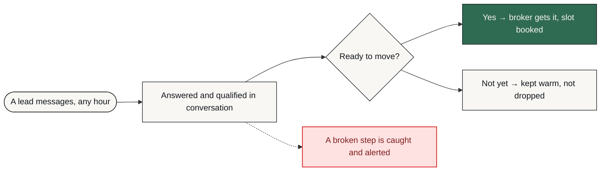
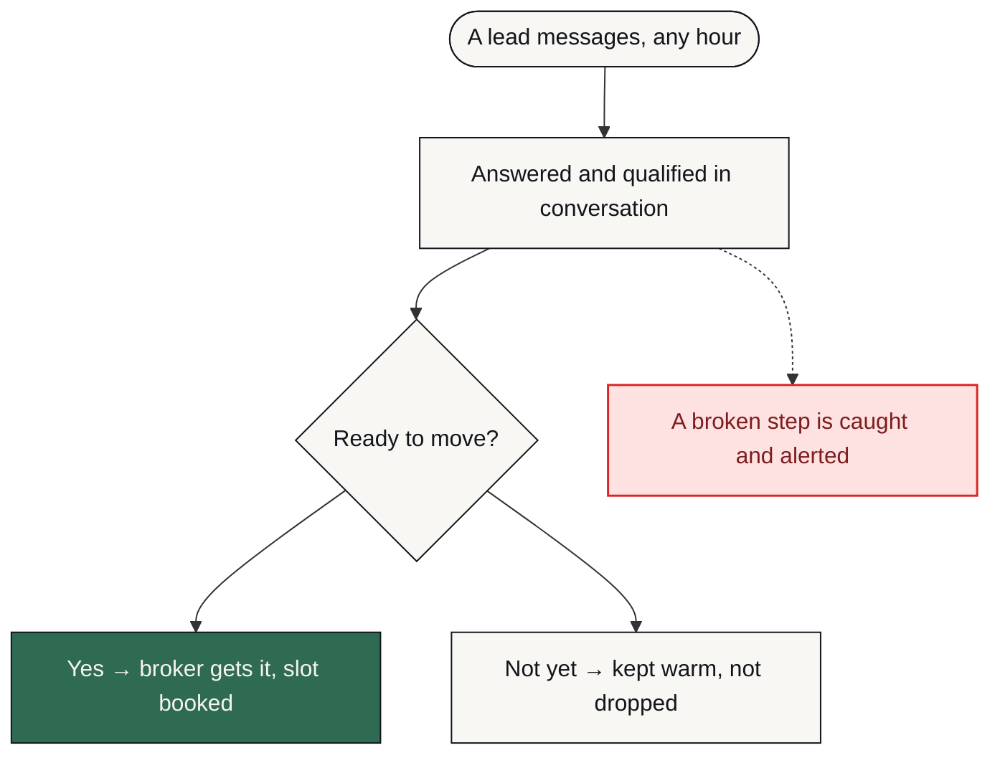

# 03 · Architecture

**WhatsApp Lead Qualifier**

---

## What this diagram is, and is not

This is the client's-eye view: what happens to their work, in the order they experience it. It is deliberately not the build.

The internal node graph, the execution order, the prompts, the scoring thresholds and the integration wiring are not published here and will not be. That is not evasiveness — it is the same discretion a client's own system would get. What is published is enough to judge whether the thinking is sound.

## The flow, left to right

## The same flow, top down

## Visual key

| Shape | Means |
| :--- | :--- |
| **rounded** | Where the client's process starts |
| **box** | Something the system does |
| **diamond** | A decision point |
| **slanted** | A person has to act |
| **green box** | The good outcome |
| **red box** | Failure path — held, escalated or alerted |

Shape carries the meaning alongside colour, deliberately. Roughly one in twelve men cannot reliably separate the green node from the red one, and a diagram whose only signal is colour is a diagram that fails for them.

## Where failure branches off

The red blocks above are not exceptions bolted on afterwards. They were drawn first. The failure table in [04 · Failure handling](04-failure-handling.md) maps each one to a detection method and an alert destination.

---

[← 02 · The journey](02-journey.md) · [04 · Failure handling →](04-failure-handling.md)
